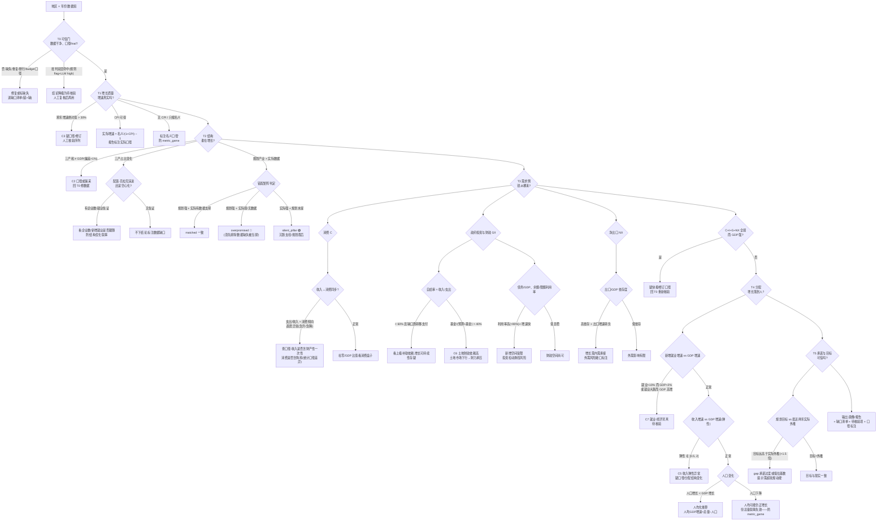

# 地区经济分析决策树(经济学 × 第一性原理)

> 版本:2026-09-08 · 配套项目 `stats-collector`(M4 全省横比 / M5 泉州画像 / M6 经济驱动 / 批判审读)
> 用途:把「一组地区年度数据」转化为「可信、有经济学逻辑、防政府美化误导」的结论;树上的每个判定在项目中都有对应代码模块与数据支撑(见 §5 映射)。
> **代码化状态:M8 已将本树实现为可执行引擎 `app/analysis/decision_tree.py`(`tree_audit`,T0-T5 共 18 节点裁决),集成到 Kami 经济画像报告第五章「方法论体检」、`quanzhou.py --tree` CLI 与 `/api/quanzhou/tree`;同时顺带修复消费/出口/债务取数的同年错位(A10)。详见 `docs/planning/DESIGN_M8_DECISION_TREE.md` 与 PROGRESS §4.8。**

---

## 0. 第一性原理基座

决策树不是指标清单,而是从六条经济学「恒等式/公理」长出来的推理骨架。任何一步脱离这些基座,就会滑向「数据罗列」或「叙事附会」:

| # | 基座 | 表述 | 它挡住了什么 |
|---|------|------|------------|
| P1 | 支出法恒等式 | `Y = C + I + G + NX` | 只报「三产增长」却不说需求从哪来 → 增长无归因 |
| P2 | 增长核算 | `ΔY/Y ≈ α·ΔK/K + β·ΔL/L + ΔA/A`(索洛) | 把「资本/人口堆出来的增长」讲成「效率/竞争力提升」 |
| P3 | 政府预算恒等式 | `G − T = ΔD + ΔF`(支出−收入 = 新增债务 + 基金缺口) | 只看「办了大事」不看「钱从哪来、以后怎么还」 |
| P4 | 消费函数与恩格尔 | `C = c(Y)`、支出份额随收入下降(食品) | 收入涨了却说消费疲弱(口径错),或反之 |
| P5 | 名义 vs 实际 | 实际增速 ≈ 名义增速 − CPI 通胀 | 「增长 6%」是名义还是实际——口径游戏高发区 |
| P6 | 披露激励(信息不对称) | 政府文件选择性披露:报喜不报忧、修辞包装 | 把「表述」当「事实」——批判审读的存在理由 |

**贯穿性原则**:
- **错 > 缺**:数据缺失可见、标注、走「缺口清单」;数据错误会静默污染结论。
- **只提示、不结论**:任何规则/LLM 命中只升级为「待核验」标注,不做终局断言(双层命中才升级)。
- **口径透明**:预算执行(budget)≠ 决算(final)、快报 ≠ 修订终值、名义 ≠ 实际、出口含转口 ≠ 本地增值——全程携带口径标签。

---

## 1. 总决策树



## 2. 分阶段文字决策树(逐节点)

### T0 可信门——先验数据,再谈经济
```
数据组
├─ 口径检查:caliber != final(budget/flash)?→ 标注口径,默认不进分析
├─ 完整性:指标缺失 / 值可疑(断行残片、>±30% 突变)?→ 修复或进「缺口清单」
├─ 重复性:同键多值?→ 单值化已收敛;残余歧义行标注
├─ 双层批判命中?(规则 flag + LLM high 同主题)→ 该指标结论降级「待核验」
└─ 通过 → T1
```

### T1 增长质量——名义与实际的分离
```
GDP 增速
├─ |名义增速| > 30% → C3 疑点:口径切换/修订/错值 → 回 T0
├─ CPI 序列可得 → 实际增速 = (1+名义)/(1+CPI) − 1,报告用它
├─ 只有名义 → 报告显式写「名义增速」,禁与别市实际增速直接比
└─ 增速可信 → T2
```

### T2 结构——增长的构成与产业真伪
```
结构
├─ 三产和 ≈ GDP?(偏差 ≤1%)→ 否 → C2:口径/漏采 → 回 T0
├─ 产业占比迁移:
│   ├─ 一产降、二三产升 → 配第-克拉克常态演进(不必惊叹)
│   ├─ 二产份额快速下降:
│   │   ├─ 有规上企业数与增加值佐证 → 判断「升级」(高附加值占比升)还是「空心化」
│   │   └─ 无佐证 → 不下结论(缺口清单)
│   └─ 名义占比变化 → 用平减后占比复核(防价格因素冒充结构变化)
└─ 规划 × 实际错配(industry_gap):
    ├─ 规划支柱 + 实际增速/企业数/份额有支撑 → matched
    ├─ 规划强 + 无实际数据 → ⚠ 先区分「数据缺失」与「真的弱」再定 overpromised
    ├─ 实际数据强 + 规划未提 → silent_pillar(规划滞后于现实)
    └─ 均弱 → weak,低关注
```

### T3 需求侧——Y = C + I + G + NX 的归因
```
┌ 消费 C
│   ├─ 人均可支配收入增速 vs 人均消费支出增速:
│   │   ├─ 支出增速 ≈ 收入增速 → 消费倾向稳定
│   │   ├─ 倾向急升 → 查:收入是否含一次性/财产性?(口径噪声)
│   │   └─ 倾向急降 → 查:预防性储蓄↑?还是把购房支出计入(统计口径差异)?
│   ├─ 恩格尔系数 = 食品烟酒/消费支出:趋势比绝对值可信;跨市比须同口径
│   └─ 社零/GDP:消费盘子大小;注意社零不含服务消费 → 三产发达市低估
├─ 政府侧 G/I(财政与债务):
│   ├─ 自给率 = 一般公共预算收入/支出:
│   │   ├─ < 60% → 依赖上级转移支付,「财政自生能力」弱
│   │   └─ 接近/超过 100% → 有自我造血能力
│   ├─ 土地依赖度 = 政府性基金/(一般预算+基金):
│   │   └─ > 40% → C6 高依赖:土地市场下行 → 财力与投资双承压
│   ├─ 债务:余额/GDP(杠杆)、余额/中央限额(空间利用率):
│   │   ├─ 利用率 >90% + 债务增速 > GDP → 新投资受限额约束,增长换挡风险
│   │   └─ 空间充足 → 逆周期能力尚可(也要看项目回报)
│   └─ 税收/GDP(宏观税负代理)与收入质量:税收占比低 → 非税/土地依赖
├─ 净出口 NX:
│   ├─ 出口/GDP 依存度 + 净出口符号:
│   │   ├─ 高依存 + 出口转负 → 外需回落,内需能否承接?
│   │   └─ 低依存 → 外需冲击有限
│   └─ 出口结构(若可得):劳动密集 vs 资本技术密集 → 竞争力叙事
└─ 恒等式体检:C/I/G/NX 各项对增速的贡献(若都有增量数据):
    ├─ 三项皆弱而 GDP 强 → 快报/修订口径疑点 → 回 T0
    └─ 至少一项有支撑 → 增长有归因,进入 T4
```

### T4 分配——增长是否落到人
```
┌ 就业
│   └─ 新增就业增速 vs GDP 增速:
│       ├─ 就业 >+10% 而 GDP <+2% → C7 背离(或就业统计口径变化)
│       ├─ 就业负增长而 GDP 高增 → 资本替代/统计背离 → 待核验
│       └─ 同步 → 增长有就业含量
├─ 收入
│   └─ 居民收入增速 ÷ GDP 增速 = 收入弹性:
│       ├─ ∉ [0.5, 2] → C5:疑口径(农村/城镇并表?)、或分配结构剧变
│       └─ ∈ 区间 → 分配基本同步
├─ 人口(常住):
│   ├─ 人口增速 → 人均化:人均 GDP/收入增速 = 名义增速差人口增速
│   └─ 人口流失 + 总量增长 → 「总量好看、人均停滞」叙事必查(metric_game)
└─ → T5
```

### T5 承诺与目标——plan 与现实之间的张力
```
┌ 规划/报告目标(五年规划、年度政府工作报告):
│   ├─ GDP/收入/就业目标 vs 最近两年实际外推:
│   │   ├─ 目标显著高于外推 → gap 提示:要么有未披露的超常规动能,
│   │   │                         要么目标偏乐观(政治周期驱动)
│   │   └─ 目标 ≈ 外推 → 目标可信
│   └─ 目标跨文档混用时(不同规划期)→ 禁止拼凑「目标组合」,标注 period
├─ 财政承诺(支出安排)vs 当年财力(收入+债务空间+转移支付):
│   └─ 承诺支出 > 可得财力 → 执行中靠借新还旧/压减的隐患
└─ 合成输出:
    ① 画像结论(每项带 year/unit/source/caliber)
    ② 缺口清单(哪些判定因数据缺失未做)
    ③ 待核验项(双层命中/规则 flag)
    ④ 口径标注(名义/预算/快报/含转口…)
```

---

## 3. 节点 × 原理 × 数据 × 模块明细表

| 节点 | 核心问题 | 经济学原理 | 所需数据(表/来源) | 支撑模块(函数) | 判定/参考线 | 输出 |
|---|---|---|---|---|---|---|
| T0 | 数据可信吗 | P6 披露激励 | pages/doc_category、caliber、raw_text | `db._migrate`、`rule_checks`、`llm_critique`+`merge_checks` | 双层命中→待核验;缺失→缺口清单 | 标注/剔除 |
| T1 | 增长真实吗 | P5 名义≠实际 | GDP 两年+、CPI 序列 | `core.analyze`、`rule_checks C3`、`econ_series(cpi)` | C3 阈值 ±30% | 实际增速 |
| C2 | 三产和=GDP? | 会计恒等式 | 三产+GDP 同一年 | `rule_checks C2` | 偏差 ≤1% ok;>3% high | flag/ok |
| C3 | 跨年突变 | 经济惯性(增长率连续) | 各指标两年序列 | `rule_checks C3` | ±30% | flag/ok |
| T2a | 结构演进还是空心化 | 配第-克拉克 | 三产占比、规上企业数、就业 | `core.analyze`、`industry_data`、`enterprises` | 需多源互证 | 判读+缺口 |
| T2b | 规划×实际错配 | P2 增长核算(规划要落地为企业/产出) | 规划产业(insights)+ 五经普/年鉴 8-8 + 企业归类 | `industry_gap.growth_contribution`、`industry_gap.industry_gap` | strong_share 10/weak_share 5(生产默认) | matched/overpromised/silent_pillar |
| C5 | 收入/GDP 弹性 | 预算收入与税基联动 | 收入两年、GDP 两年 | `rule_checks C5` | 弹性 ∈ [0.5, 2] | flag/ok |
| C6 | 土地财政依赖 | P3 预算恒等式 | 一般预算收入、政府性基金收入 | `rule_checks C6`;`quanzhou.analyze_quanzhou`(land_dependence) | >40% flag | flag/ok |
| C7 | 就业-经济背离 | 奥肯定律(弱式) | 新增就业两年、GDP 两年 | `rule_checks C7` | 就业>10% vs GDP<2%(或反向) | flag/提示 |
| T3C | 消费支撑 | P4 消费函数/恩格尔 | 收入/支出/食品烟酒/社零、GDP | `consumption.consumption_support` | 倾向与恩格尔看趋势;社零/GDP 看盘子 | propensity/engel/retail_gdp_ratio |
| T3G | 财政与债务 | P3 预算恒等式 | 收支、基金、债务余额/限额 | `quanzhou.analyze_quanzhou`(self_sufficiency/fiscal_intensity/tax_ratio)、`investment.investment_support` | 自给率<60% 弱;土地>40% 高;限额利用率>90% 紧 | 比率序列 |
| T3X | 净出口 | 开放经济恒等式 | 出口/进口序列(亿美元/亿元口径统一)、GDP | `trade.trade_support` | 依存度+净出口符号(须同年!) | export_gdp_ratio/net_export |
| T4 | 增长落到人 | 分配与就业 | 新增就业、收入、常住人口 | `quanzhou.analyze_quanzhou`(employment/market)、`hhi` | C5/C7 阈值;人均化重算 | 就业密度/人均 |
| T5 | 承诺可信 | 政府目标函数与激励 | plan_goal insights、预算报告 | `quanzhou.analyze_quanzhou`(plan)、`economy_report` 五章 | 目标 vs 实际外推 | gap 提示 |

## 4. 反模式清单(决策树每层要防的坑)

| 反模式 | 后果 | 对应防线 |
|---|---|---|
| 数据缺失当「产业弱/规划过度承诺」 | 采集缺口被渲染成负面经济结论 | 缺数据走缺口清单,`industry_gap` 区分 None 与 0 |
| 预算执行数(2026H1)当年度决算 | 跨年增速 −49% 假值 | caliber 隔离,分析只吃 final |
| 「下降 2.1%」被存成正增长 | 方向反转 | 方向词捕获、负号保留(T10 教训) |
| 子口径当总量(海关代征/民营/累计) | 同键多值、污染时序 | 单值化主口径收敛(A1 教训) |
| 名义增速当实际增速 | 高估真实增长 | CPI 平减;无 CPI 必须标注 |
| 人均指标缺席下的总量叙事 | 人口流失被掩盖 | 常住人口 → 人均化重算 |
| 转口/加工贸易出口当本地增值 | 依存度虚高 | 出口结构细分(数据可得时) |
| 「结构优化」无企业/就业佐证 | 空心化被包装成升级 | 三产份额变化必须有实体侧互证 |
| 把批判/规则命中当结论 | 误伤或漏报 | 双层升级为「待核验」而非终局 |
| 跨文档拼接目标(gap 判定跨规划期) | 现实中不存在的目标组合 | plan 聚合带 period 标注 |

## 5. 与代码映射(快速定位)

| 决策树层 | 模块 | 入口 |
|---|---|---|
| T0 可信门 | `app/extract/critique.py`、`app/store/db.py` | `rule_checks` / `llm_critique` / `merge_checks` |
| T1 增长 | `app/analysis/core.py` | `analyze`(全省横比)/`_growth` |
| C2/C3/C5/C6/C7 | `app/extract/critique.py` | `rule_checks` |
| T2 错配 | `app/analysis/industry_gap.py` | `growth_contribution` / `industry_gap` / `_plan_industries` |
| T3C 消费 | `app/analysis/consumption.py` | `consumption_support` |
| T3G 财政/债务 | `app/analysis/quanzhou.py`、`app/analysis/investment.py` | `analyze_quanzhou` / `investment_support` |
| T3X 出口 | `app/analysis/trade.py` | `trade_support` |
| T4 分配 | `app/analysis/quanzhou.py` | `analyze_quanzhou`(employment/market/hhi) |
| T5 承诺 | `app/analysis/quanzhou.py`、`app/analysis/economy_report.py` | `analyze_quanzhou`(plan)/五章组装 |
| 渲染 | `app/analysis/report.py` / `kami.py` / `economy_report.py` | HTML/Markdown/Kami Parchment |

## 6. 使用说明

1. **一棵树走到底,不许跳层**:跳过 T0 直接下结论 = 把数据错误带进判断;跳过 T3 只谈结构 = 增长无需求归因。
2. **每个输出必须携带**:指标名、年份、单位、口径(caliber)、来源(页面/规则)、置信状态(正常/待核验)。
3. **缺口与待核验是报告的正式组成部分**,不是失败——「不知道」和「存疑」本身就是对使用者最有价值的信息。
4. 跨地区比较时,所有阈值线(自给率 60%、土地依赖 40%、弹性 [0.5,2] 等)只做**同口径相对参考**,跨省比较须先对齐转移支付/口径差异(如粤闽浙财政体制不同)。
5. 本树是「分析过程」的决策骨架——它不产出最终判断,产出的是**带证据链的判断候选 + 缺口 + 疑点**,最终解读交给使用者。
